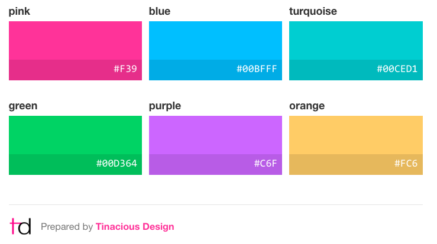
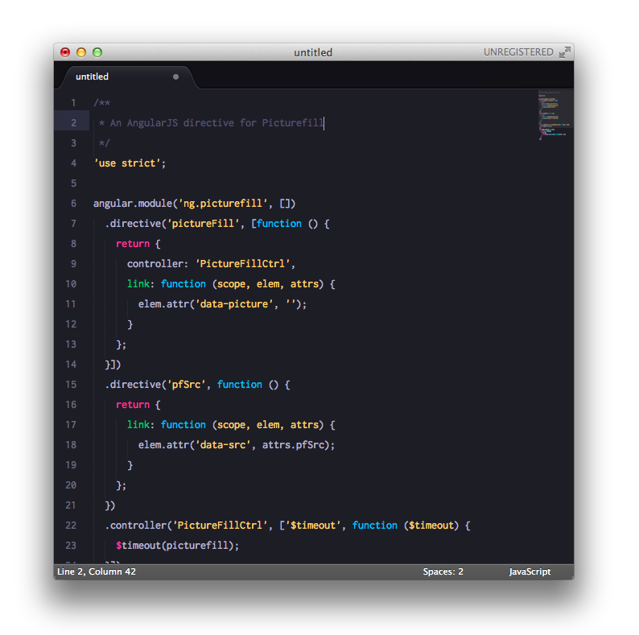
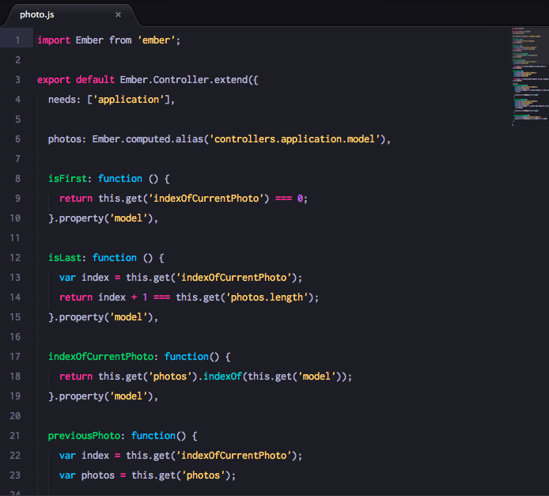
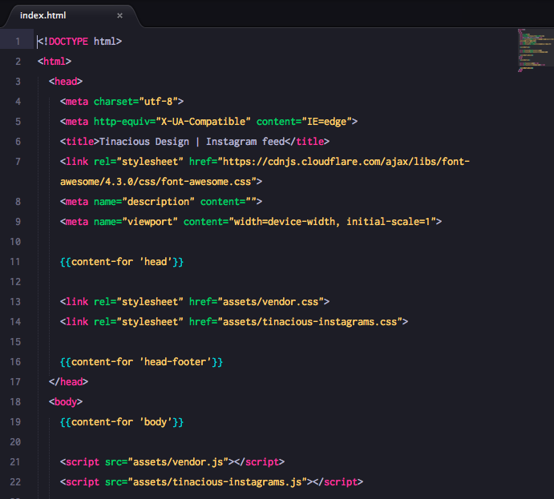
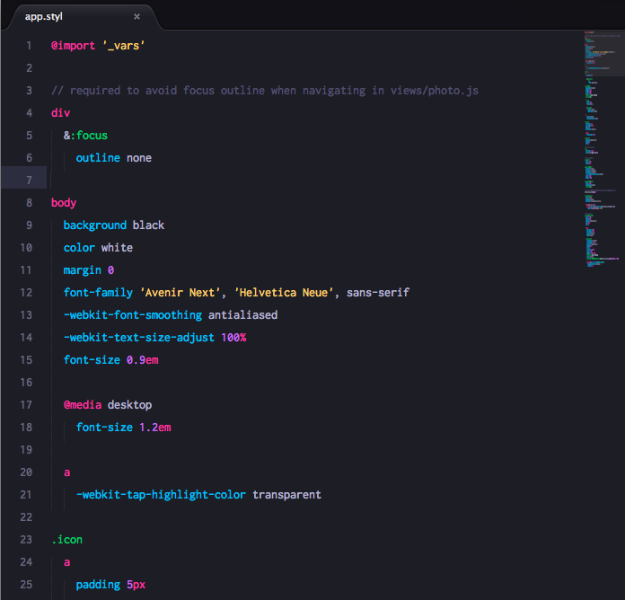

**Tinacious Design Syntax** is a dark syntax theme that uses a bright palette of colours including pink, blue, turquoise, green, purple, and orange.

Colours curated by Web and Mobile designer and developer Tina from [Tinacious Design](http://tinaciousdesign.com).

## Changelog

### 0.1.0 - Initial Release
- Initial release
